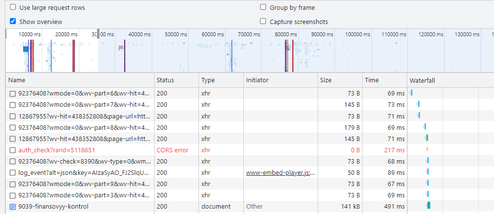
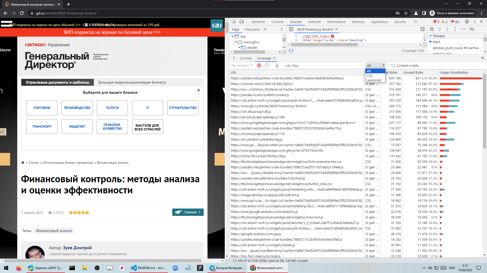

# ШРИ: Тулинг 2023 часть 2
##[ресурс для проверки](https://www.gd.ru/articles/9039-finansovyy-kontrol)

## Вкладка Network
[файл профиль загрузки ресурсов при открытии страницы](./www.gd.ru.har)

### Дублирование ресурсов

JS:
 - https://cdn.jsdelivr.net/npm/@popperjs/core@2.10.2/dist/umd/popper.min.js
  
  - https://code.jquery.com/jquery-3.5.1.js
  
  - https://top-fwz1.mail.ru/js/code.js
  
  - https://cdn.jsdelivr.net/npm/bootstrap@5.1.3/dist/js/bootstrap.min.js
  

CSS:
  - https://cdn.jsdelivr.net/npm/bootstrap@5.1.3/dist/css/bootstrap.min.css
  

IMG:
  - [ссылка на картинку](data:image/png;base64,iVBORw0KGgoAAAANSUhEUgAAABgAAAAWCAYAAADafVyIAAAAAXNSR0IB2cksfwAAAARnQU1BAACxjwv8YQUAAAAJcEhZcwAACxMAAAsTAQCanBgAAANlSURBVEhLlZRtSJNRFMf/0205s8w3LKJRCgMDFdKo0MgIIQQpgvpiQl+0D34wSf0oYVn5IYTCIQwLzKK0ItIVYiaFLwXaDKa2pulmTZdN3cxMU0/3ubtl5jNdP3i4955znvu/L+dc0H/w4cULelpYKEb+EYD/4P2jR+i9fRueqSlhWR+/BaanpzHU1IQZpxPOnh5hXR+/BT53dmLSauV9c20tb/3Bb4H+ujrRA2wtLbCbTGK0Nn4JOPr7YW9thSo4GEEREXDbbLA2NAjv2vgl0Hf/PtzDw4hOTkZyfj5Y6mGACUy5XCLCN4oOvZ4W5+fFUAY22Vu9np//kYoKxGZkwLB7NwJVKuw9fx7BUVE8hqNQeNu/UJju3aPW4mJ47HZhkkep0eCsxYLIHTtQc/Qoz6i12LBlC/YVFUEhFYOluRntZWUYefmSO5XsrKMSE6HetAnSmqT1hcXG4hjbiURXTQ3Md+7wvsTSz5/4ajZjdnycj8N0Ouxnk8edOiXtzotrbIyMBQV0Ua2mUqWSDKmpZOvuFl7fjNvtVJeVRWUbN9IFhYJqMzNp1GoVXnZ2ov1Dr9FIFTt30gWmXRYSQtIdscsU3mU8bjf1NzVRxa5dPPZyaCi137hBrMpFhJdVAhKf+vroSV4elapU/Gu9ckV4lhloa6PLmzfzyW+lp5OFvVNyyKbp9rg4pJaUIHrPHn6+QWFhwrNMELvEAKWS+9LY/ekOHxaelfisgzmPh2eWJjIS2kOH8I29Re8ePkT79evwTE4iVKvFNlYXP9jD5x4aEn+txqfAaFcXvo+NYWtSEtQhIegsL0djdjZaCgrwNCcHX1nKxrCakGpgwGiEe2JC/LkSWQF2gRh+/ly6H4Sz43pw/Dg62DEszs1xv4XtpI7VglQbEkMszaXnQw5ZgcnBQXx89oz3TZWVcHZ3Q8MqNqO6Gqfb2hCVkIBZtuLmvDwoAgIwMzqKkVevePy/yApIBffN4eB9WliA7sQJnGxsRPKZM4g5cAAn2Tt0sLQUgWo1aGmJxw0wvyzeZFqJISWFp9/V8HB6YzDwnJdjsKODKuPjeayUzl9sNuFZZpWAy+GgSxoNXdNq6e3du8LqG5vJRDfT0riAXPwqgZ76enqcm0sjZrOwrM+E00mvq6qo8dw5YfkN0S9QfTRgJK32dwAAAABJRU5ErkJggg==)
  

OTHER:
  - https://www.gd.ru/themes/gd_ru/favicon-32x32.png
  

### Лишний размер ресурса

Сетка представлена набором фотографий, для аналогичного визуального решения можно было использовать один и фон, а поверх указать надписи.
Проще в работе и сайт быстрее.
- [ссылка на фото ДИДЖИТАЛ - сегмент сетки №1](https://1gd.ru/system/content/image/250/1/-36948746/)
  
  сетка:
  
- [ссылка на фото ТОРГОВЛЯ - сегмент сетки №2](https://1gd.ru/system/content/image/250/1/-38610725/)
  
  сетка:
  

Нет сжатия css:
  - https://www.gd.ru/assets/f8e4500d/assets/frontend/css/layouts.other.css?cache=5a6fa72bdfc8007242bf089feb2ff92203bc8762
  - https://tbcdnwidgetsprod.azureedge.net/widget/css/button_style.css
  - https://cdn.action-mcfr.ru/widgets/prod/favorite/1_0_0/main.cd67f12d042d3a9a9e27.css
  - https://cdn.action-mcfr.ru/widgets/prod/auth-button/1_0_0/main.a4ed37dfa98566caf03c.css
  - https://www.gd.ru/assets/f8e4500d/modules/statBlock/widgets/views/StatBlockWidget/assets/css/statblock.css?cache=5a6fa72bdfc8007242bf089feb2ff92203bc8762

Нет сжатия js:
  - https://code.jquery.com/jquery-3.5.1.js
  - https://vk.com/js/al/lite.js?107

  - https://vk.com/js/api/openapi.js?116

  - https://vk.com/js/api/openapi.js?169
  - https://widget.textback.io/widget/widget.js
  - https://www.gd.ru/assets/f8e4500d/assets/frontend/scripts/vote.action.js?cache=5a6fa72bdfc8007242bf089feb2ff92203bc8762
  - https://st.vk.com/js/api/xdm.js?9
  - https://www.gd.ru/assets/f8e4500d/assets/frontend/assets/action/custom-pages/content.js?cache=5a6fa72bdfc8007242bf089feb2ff92203bc8762
  - https://cdn.afp.ai/ssp/sdk_review.js
  - https://www.gd.ru/assets/f8e4500d/modules/id2Auth/assets/js/AuthButtonWidget.js?cache=5a6fa72bdfc8007242bf089feb2ff92203bc8762
  - https://www.gd.ru/assets/f8e4500d/widgets/views/EventSendsayAutomailWidget/assets/js/EventSendsayAutomail.js?cache=5a6fa72bdfc8007242bf089feb2ff92203bc8762
  - https://id2.actionmarketing.ru/action_marketing_banners/pixel/actmarketingpixel.js
  - https://www.gd.ru/assets/f8e4500d/modules/eJournal/widgets/views/HeaderRightBlockWidget/assets/js/view.js?cache=5a6fa72bdfc8007242bf089feb2ff92203bc8762
  - https://www.gd.ru/assets/f8e4500d/assets/frontend/assets/action/overal/mobile.menu.js?cache=5a6fa72bdfc8007242bf089feb2ff92203bc8762
  - https://www.gd.ru/assets/f8e4500d/assets/common/js/html/HTMLHelper.js?cache=5a6fa72bdfc8007242bf089feb2ff92203bc8762
  - https://www.gd.ru/assets/f8e4500d/modules/template/assets/js/SystemHelper.js?cache=5a6fa72bdfc8007242bf089feb2ff92203bc8762
  - https://www.gd.ru/assets/f8e4500d/modules/template/assets/js/RedblockHelper.js?cache=5a6fa72bdfc8007242bf089feb2ff92203bc8762
  - https://www.gd.ru/assets/f8e4500d/modules/event/widgets/views/EventPodpiskaWidget/assets/js/eventPodpiskaWidget.js?cache=5a6fa72bdfc8007242bf089feb2ff92203bc8762
  - https://www.gd.ru/assets/f8e4500d/modules/eJournal/assets/js/EJournalHelper.js?cache=5a6fa72bdfc8007242bf089feb2ff92203bc8762

Повторное подключение набора шрифтов:
  - https://tbcdnwidgetsprod.azureedge.net/widget/fonts/fontawesome-webfont.woff2?v=4.7.0
  - https://www.gd.ru/assets/fonts/fontawesome-webfont.woff2?v=4.7.0
  

### Медленно загружающиеся ресурсы

Скрипты:
  - https://vk.com/js/loader_nav2090385382_0.js
  - https://vk.com/js/lang0_0.js?28118605
  - https://st.vk.com/dist/api/widgets/community.js?1

Изображения:
  
  

### Ресурсы, блокирующие загрузку

  

## Вкладка Performance

  [файл профиль загрузки страницы](./Trace-20230619T030031.json)
Измерить время в миллисекундах от начала навигации до событий:
  - First Paint: 942.8 ms
  - First Contentful Paint: 942.8 ms
  - DOMContentLoaded Event: 1507.5 ms
  - Largest Contentful Paint: 1610.1 ms
  - Onload Event: 4080.2 ms

Измерить, сколько времени в миллисекундах тратится на разные этапы обработки документа:
 - Loading: 42 ms
 - Scripting: 1434 ms
 - Rendering: 618 ms
 - Painting: 52 ms

 

определить, на каком DOM-элементе происходит LCP
  - селектор элемента: body > div.branded__center.ASE_brandImage > div > a > div > img

  - Нашёл с помощью скрипта:
  
  - Сам элемент:
  

## Вкладка Coverage

Сохранить скриншот вкладки после загрузки страницы:

 
 
 

Объём неиспользованных данных всего: 2.7 MB
Объём неиспользованных данных JS: 2.3 MB
Объём неиспользованных данных CSS: 553 kB
